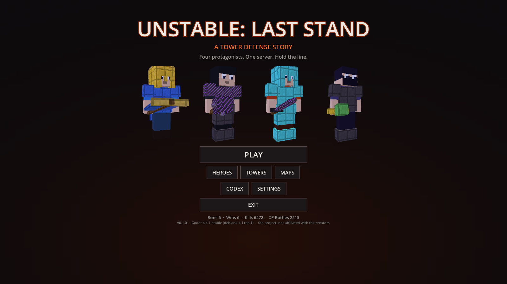
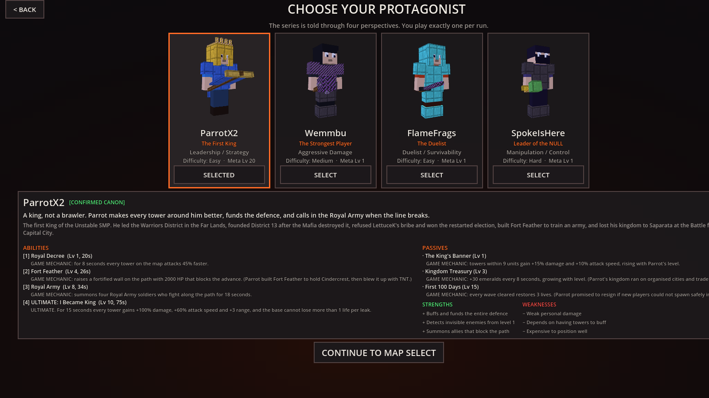
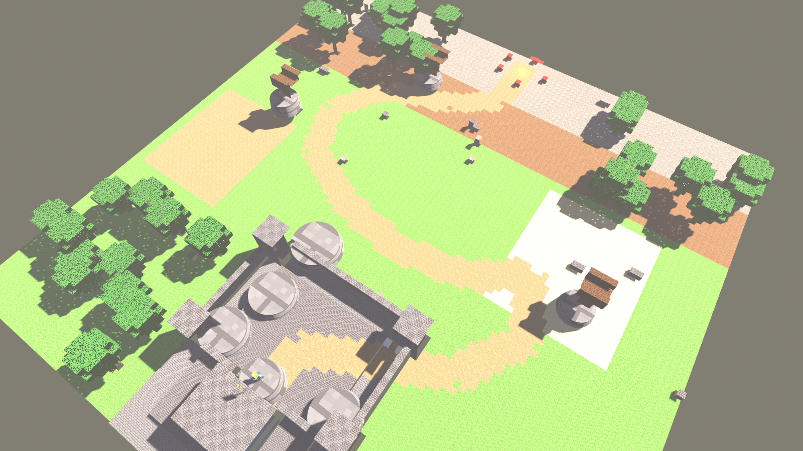
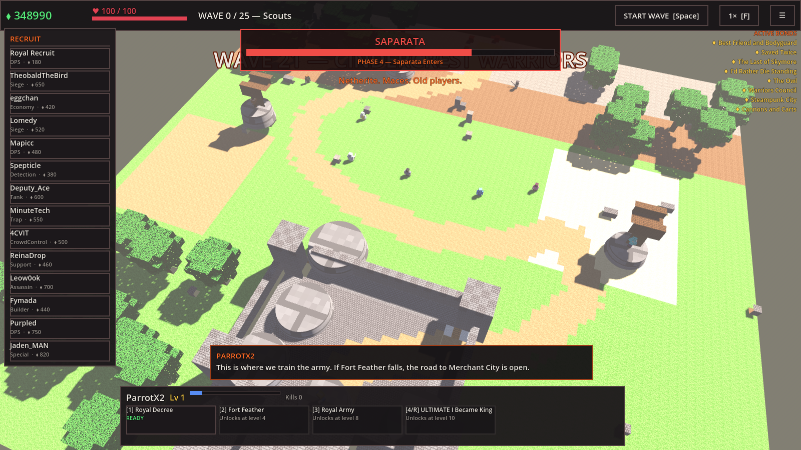
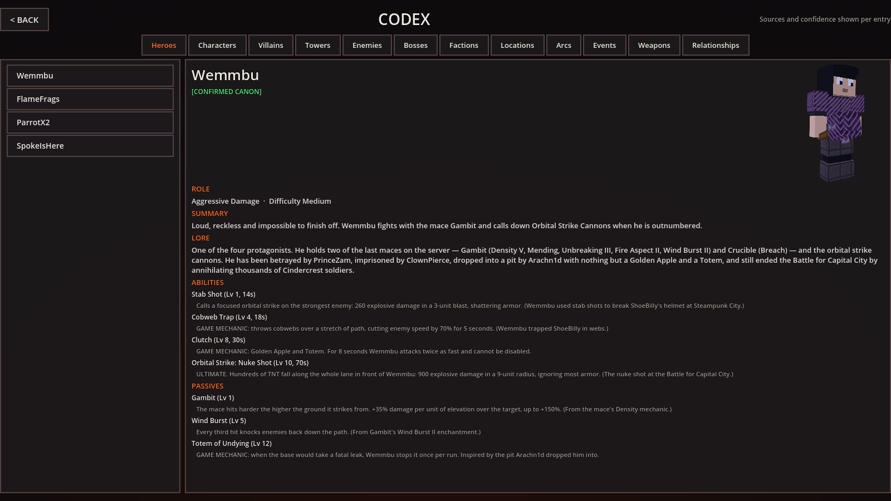
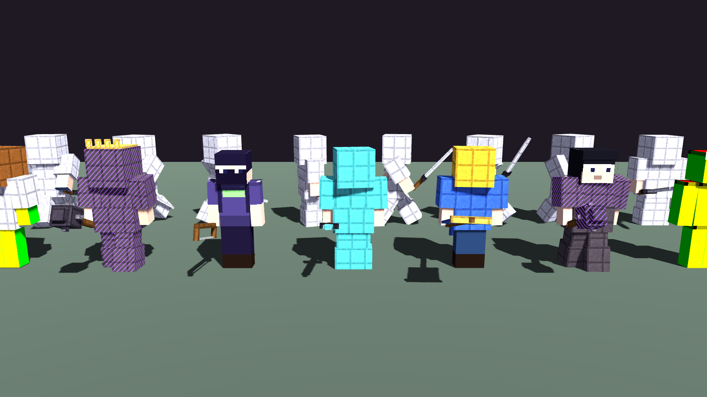

# UNSTABLE: LAST STAND
### A Tower Defense Story

A 3D tower-defense game set in the Unstable Universe. You pick one of the four protagonists, recruit
the SMP's characters as towers, and hold a location against a researched enemy faction while their
Minecraft gear visibly escalates from a wooden sword to enchanted netherite.

> **Unofficial fan project.** Not affiliated with, endorsed by, or sponsored by the Unstable Universe
> creators, or by Mojang/Microsoft. No Minecraft game assets are included — all geometry, textures and
> audio in this repository are original. See [docs/ASSET_LICENSES.md](docs/ASSET_LICENSES.md).

---

## The build

| | |
|---|---|
| **Playable Windows build** | `build/windows/UNSTABLE_LAST_STAND.exe` (77 MB, PE32+ x86-64, embedded PCK) |
| **Engine** | Godot 4.4.1-stable, GDScript, Forward+ (falls back to OpenGL 3) |
| **Automated tests** | 2198 assertions, 0 failures |
| **Performance** | 1000 concurrent enemies at a flat frame cost; enemy count adds ~0 draw calls |

Run the exe directly — everything is packed inside it. There is no installer and no external data.

## Screenshots

| | |
|---|---|
|  |  |
| **Main menu** — four live 3D heroes in their gear | **Hero select** — abilities, passives, lore, confidence tiers |
|  |  |
| **Fort Feather** — the map built procedurally from block data | **In a run** — tower shop, active bonds, boss bar, hero abilities |
|  |  |
| **Codex** — the research database with sources per entry | **Gear tiers** — armour and weapons as separate 3D pieces |

## What is in the vertical slice

- **Fort Feather**, the first battle of the Unstable SMP Civil War: 25 waves, 18 build zones, a
  five-phase Saparata boss encounter, and a second map (Merchant City) unlocked by winning.
- **Four playable heroes** — ParrotX2, Wemmbu, FlameFrags, SpokeIsHere — each with three actives, an
  ultimate, three passives and an in-run level curve.
- **14 towers** drawn from researched characters, each with three upgrade paths of four tiers.
- **30 enemy types**: a seven-tier Chungie gear ladder plus elytra gliders, archers, potion brewers,
  TNT runners, invisible players, builders, shield bearers, assassins, cavalry, minecarts, totem
  carriers, withers, paratroopers and the Cindercrest command units.
- **A relationship system** with 18 bonds, every one grounded in a sourced relationship from the story.
- **An in-game Codex** exposing the whole research database with per-entry sources and confidence tiers.

## Running from source

```bash
godot --path . --import        # first run only
godot --path .                 # play
```

Godot 4.4.x is required. The project has no plugins and no external dependencies.

## Tests

```bash
# unit + data integrity suite (2198 assertions)
godot --headless --path . -s tests/run_headless.gd -- res://tests/test_suite.gd 4

# full-run smoke test: builds a map, places and upgrades towers, runs waves
godot --headless --path . -s tests/run_headless.gd -- res://tests/headless_run.gd 1500

# boss encounter: verifies all five Saparata phases, the mini-boss and the blimp
godot --headless --path . -s tests/run_headless.gd -- res://tests/boss_test.gd 2000

# performance: 50 / 100 / 250 / 500 / 1000 concurrent enemies
godot --headless --path . -s tests/run_headless.gd -- res://tests/stress_test.gd 1400
```

Visual tests render to a PNG and need a display (`xvfb-run` works):

```bash
xvfb-run -a -s "-screen 0 1280x720x24" godot --path . --rendering-driver opengl3 \
  -s tests/run_visual.gd -- res://tests/visual_game_test.gd build/screen_game.png 40
```

## Building the Windows executable

```bash
godot --headless --path . --export-release "Windows Desktop" build/windows/UNSTABLE_LAST_STAND.exe
```

Requires the Godot 4.4.1 Windows export templates. See [docs/BUILD_REPORT.md](docs/BUILD_REPORT.md)
for how the templates used here were produced.

## Supplying real character skins

Every character renders from a Minecraft-compatible skin PNG. The repository ships **procedurally
generated placeholders** — they are not the real creators' skins.

To use a real skin, drop a 64×64 (or legacy 64×32, or an HD multiple) PNG at either:

- `assets/skins/<character_id>.png` — baked into the build, or
- `user://skins/<character_id>.png` — loaded at runtime, takes priority, no rebuild needed.

The character ids are the `id` fields in `data/lore/characters.json` (`wemmbu`, `parrotx2`,
`flamefrags`, `spokeishere`, `theobaldthebird`, `saparata`, …). Slim ("Alex") arms are detected
automatically; set `"model": "slim"` in the manifest to force it. Nothing else needs changing — the
skin is parsed, UV-mapped onto the 3D character and used everywhere that character appears.

You are responsible for having the right to use any skin you add. See
[docs/ASSET_LICENSES.md](docs/ASSET_LICENSES.md).

## Regenerating the placeholder assets

```bash
python3 tools/gen_assets.py    # skins, block textures, armor pattern  (needs Pillow)
python3 tools/gen_audio.py     # all music and sound effects           (stdlib only)
```

`gen_assets.py` never overwrites a skin that the manifest does not mark as a generated placeholder.

## Documentation

| Document | Contents |
|---|---|
| [GAME_DESIGN.md](docs/GAME_DESIGN.md) | Core loop, economy, the Gear Rule, heroes, relationships, balance |
| [ARCHITECTURE.md](docs/ARCHITECTURE.md) | Systems, data flow, the data-oriented enemy pool, rendering |
| [LORE_RESEARCH.md](docs/LORE_RESEARCH.md) | Method, sources, confidence tiers, contradictions found |
| [CHARACTER_DATABASE.md](docs/CHARACTER_DATABASE.md) | Every researched character and their gameplay role |
| [TOWER_DATABASE.md](docs/TOWER_DATABASE.md) | All 14 towers with full upgrade trees |
| [ENEMY_DATABASE.md](docs/ENEMY_DATABASE.md) | All 30 enemies, the Chungie ladder, why each exists |
| [BOSS_DATABASE.md](docs/BOSS_DATABASE.md) | Saparata's five phases and their basis in the story |
| [MAP_DATABASE.md](docs/MAP_DATABASE.md) | Implemented maps and the researched candidates behind them |
| [ASSET_LICENSES.md](docs/ASSET_LICENSES.md) | Asset manifest, provenance, what is a placeholder |
| [TEST_REPORT.md](docs/TEST_REPORT.md) | What was tested, how, and the actual results |
| [BUILD_REPORT.md](docs/BUILD_REPORT.md) | Engine version, templates, export settings, verification |
| [KNOWN_LIMITATIONS.md](docs/KNOWN_LIMITATIONS.md) | What is missing, unverified, or deliberately deferred |

## Controls

| | |
|---|---|
| WASD / arrows | Pan camera |
| Q / E | Rotate camera |
| Mouse wheel | Zoom |
| Left click | Select tower, or place the tower being bought |
| Right click | Cancel placement / deselect |
| Tab | Show every tower's range |
| 1 / 2 / 3 | Hero abilities |
| 4 or R | Hero ultimate |
| Space | Start the next wave |
| F | Cycle game speed |
| Backspace | Sell the selected tower |
| Esc | Pause |
